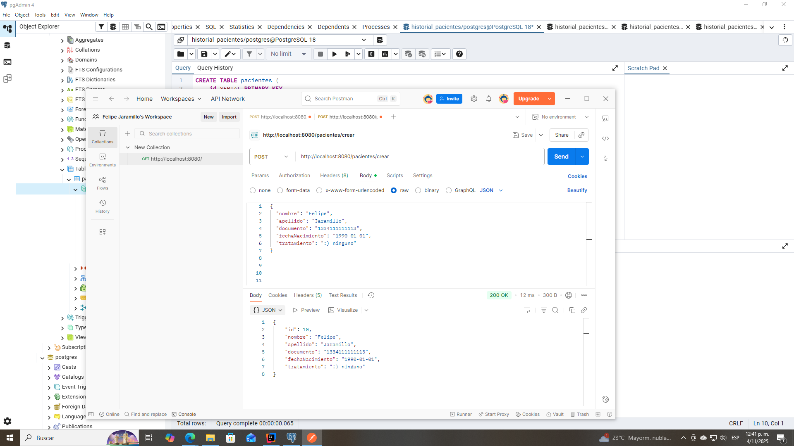
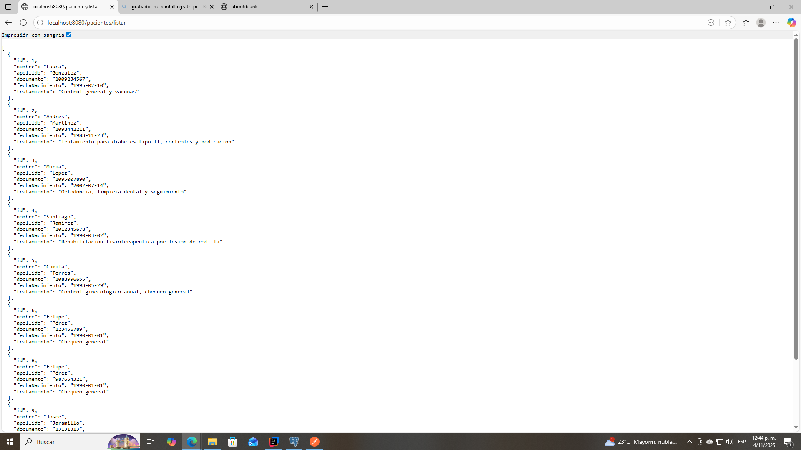

#  Historial de Pacientes - API REST practica backend 

##  Descripción General

Este proyecto implementa una **API REST c** para la gestión de un historial médico de pacientes. Está desarrollado con **Spring Boot 3.5.7** y utiliza **PostgreSQL** como base de datos. El proyecto aplica una arquitectura en capas bien definida que separa la lógica de negocio, las entidades de dominio y la exposición de servicios mediante controladores REST.

---

##  Estructura del Proyecto

```
com.felipe.historialpacientes
├── Domain
│   ├── model
│   │   ├── DTO
│   │   │   └── PacienteDTO.java
│   │   └── Entity
│   │       └── PacienteEntity.java
         └── repository
│   │       └── PacienteRepository.java
│   └── Service
│       └── PacienteService.java
└── Infraestructura
    └── PacienteController.java
```

###  Capas principales

**Domain.model:** Contiene las entidades del dominio (`Entity`) y los objetos de transferencia de datos (`DTO`).

**Domain.Service:** Implementa la lógica de negocio del sistema y las operaciones CRUD.

**Infraestructura:** Expone los endpoints REST a través del controlador y gestiona las peticiones HTTP.

---

##  Clases y Responsabilidades

###  `PacienteEntity`

Representa la entidad **Paciente** que se mapea a la tabla `pacientes` en PostgreSQL. Contiene los atributos principales del paciente: identificación, datos personales, fecha de nacimiento y tratamiento actual.

**Estructura de la tabla:**

```sql
CREATE TABLE pacientes (
    id SERIAL PRIMARY KEY,
    nombre VARCHAR(100) NOT NULL,
    apellido VARCHAR(100) NOT NULL,
    documento VARCHAR(20) UNIQUE NOT NULL,
    fecha_nacimiento DATE NOT NULL,
    tratamiento TEXT NOT NULL,
    fecha_registro TIMESTAMP DEFAULT CURRENT_TIMESTAMP
);
```

**Atributos de la entidad:**

```java
@Entity
@Table(name = "pacientes")
public class PacienteEntity {
    @Id
    @GeneratedValue(strategy = GenerationType.IDENTITY)
    private Long id;
    
    private String nombre;
    private String apellido;
    private String documento;
    private LocalDate fechaNacimiento;
    private String tratamiento;
    private LocalDateTime fechaRegistro;
}
```

---

###  `PacienteDTO`

Es un **Data Transfer Object** que permite la comunicación entre el cliente y la API sin exponer directamente las entidades de la base de datos. Esto mejora la seguridad y permite validaciones personalizadas.

```java
public class PacienteDTO {
    private String nombre;
    private String apellido;
    private String documento;
    private LocalDate fechaNacimiento;
    private String tratamiento;
    
    // Getters y Setters
}
```

El DTO asegura que solo se transfieran los datos necesarios y evita la exposición de información sensible como IDs internos o timestamps.

---

###  `PacienteService`

Encapsula toda la **lógica de negocio** del sistema. Gestiona las operaciones CRUD (Crear, Leer, Actualizar, Eliminar) utilizando el repositorio de Spring Data JPA.

**Operaciones implementadas:**

- **Crear paciente:** Valida y registra nuevos pacientes en el sistema
- **Listar pacientes:** Retorna todos los pacientes registrados
- **Buscar por documento:** Encuentra un paciente específico usando su documento de identidad
- **Actualizar tratamiento:** Modifica el tratamiento asignado a un paciente
- **Eliminar paciente:** Elimina un registro del sistema

```java
@Service
public class PacienteService {

    private final PacienteRepository repository;

    public PacienteService(PacienteRepository repository) {
        this.repository = repository;
    }

    public PacienteEntity crearPaciente(PacienteDTO dto) {
        PacienteEntity entity = new PacienteEntity();
        entity.setNombre(dto.getNombre());
        entity.setApellido(dto.getApellido());
        entity.setDocumento(dto.getDocumento());
        entity.setFechaNacimiento(dto.getFechaNacimiento());
        entity.setTratamiento(dto.getTratamiento());
        return repository.save(entity);
    }

    public List<PacienteEntity> obtenerPacientes() {
        return repository.findAll();
    }

    public PacienteEntity buscarPorDocumento(String documento) {
        return repository.findByDocumento(documento)
                .orElseThrow(() -> new RuntimeException("Paciente no encontrado"));
    }

    public PacienteEntity actualizarTratamiento(String documento, String tratamiento) {
        PacienteEntity paciente = buscarPorDocumento(documento);
        paciente.setTratamiento(tratamiento);
        return repository.save(paciente);
    }

    public String eliminarPaciente(String documento) {
        PacienteEntity paciente = buscarPorDocumento(documento);
        repository.delete(paciente);
        return "Paciente eliminado correctamente";
    }
}
```

---

###  `PacienteController`

Expone los **endpoints REST** que permiten la interacción con el sistema desde clientes externos (Postman, aplicaciones frontend, etc.). Utiliza las anotaciones de Spring Web para mapear las rutas y métodos HTTP.

```java
@RestController
@RequestMapping("/pacientes")
public class PacienteController {

    private final PacienteService service;

    public PacienteController(PacienteService service) {
        this.service = service;
    }

    @PostMapping("/crear")
    public PacienteEntity crear(@RequestBody PacienteDTO dto) {
        return service.crearPaciente(dto);
    }

    @GetMapping("/listar")
    public List<PacienteEntity> listar() {
        return service.obtenerPacientes();
    }

    @GetMapping("/buscar/{documento}")
    public PacienteEntity buscar(@PathVariable String documento) {
        return service.buscarPorDocumento(documento);
    }

    @PutMapping("/actualizarTratamiento/{documento}")
    public PacienteEntity actualizar(@PathVariable String documento, 
                                     @RequestParam String tratamiento) {
        return service.actualizarTratamiento(documento, tratamiento);
    }

    @DeleteMapping("/eliminar/{documento}")
    public String eliminar(@PathVariable String documento) {
        return service.eliminarPaciente(documento);
    }
}
```

---

##  Endpoints Disponibles 

| Método | Endpoint | Descripción | Parámetros |
|--------|----------|-------------|------------|
| **POST** | `/pacientes/crear` | Crea un nuevo paciente | Body: JSON con datos del paciente |
| **GET** | `/pacientes/listar` | Lista todos los pacientes | Ninguno |
| **GET** | `/pacientes/buscar/{documento}` | Busca un paciente por documento | Path: documento |
| **PUT** | `/pacientes/actualizarTratamiento/{documento}` | Actualiza el tratamiento | Path: documento, Query: tratamiento |
| **DELETE** | `/pacientes/eliminar/{documento}` | Elimina un paciente | Path: documento |


##  Crear paciente en postman 


##  Listar pacientes 


### Crear un nuevo paciente

**Request:**
```http
POST http://localhost:8080/pacientes/crear
Content-Type: application/json

{
  "nombre": "Felipe",
  "apellido": "Jaramillo",
  "documento": "133411111113",
  "fechaNacimiento": "1990-01-01",
  "tratamiento": ":) ninguno"
}
```

**Response (200 OK):**
```json
{
  "id": 10,
  "nombre": "Felipe",
  "apellido": "Jaramillo",
  "documento": "133411111113",
  "fechaNacimiento": "1990-01-01",
  "tratamiento": ":) ninguno",
  "fechaRegistro": "2025-11-04T12:42:38.247"
}
```

### Listar todos los pacientes

**Request:**
```http
GET http://localhost:8080/pacientes/listar
```

**Response (200 OK):**
```json
[
  {
    "id": 1,
    "nombre": "Laura",
    "apellido": "Gonzales",
    "documento": "1009234567",
    "fechaNacimiento": "1995-02-10",
    "tratamiento": "Control general y vacunas"
  },
  {
    "id": 2,
    "nombre": "Andres",
    "apellido": "Martinez",
    "documento": "1098442211",
    "fechaNacimiento": "1988-11-23",
    "tratamiento": "Tratamiento para diabetes tipo II, controles y medicación"
  }
]
```

### Buscar paciente por documento

**Request:**
```http
GET http://localhost:8080/pacientes/buscar/1009234567
```

**Response (200 OK):**
```json
{
  "id": 1,
  "nombre": "Laura",
  "apellido": "Gonzales",
  "documento": "1009234567",
  "fechaNacimiento": "1995-02-10",
  "tratamiento": "Control general y vacunas"
}
```

### Actualizar tratamiento

**Request:**
```http
PUT http://localhost:8080/pacientes/actualizarTratamiento/1009234567?tratamiento=Tratamiento actualizado
```

**Response (200 OK):**
```json
{
  "id": 1,
  "nombre": "Laura",
  "apellido": "Gonzales",
  "documento": "1009234567",
  "fechaNacimiento": "1995-02-10",
  "tratamiento": "Tratamiento actualizado"
}
```

### Eliminar paciente

**Request:**
```http
DELETE http://localhost:8080/pacientes/eliminar/1009234567
```

**Response (200 OK):**
```
Paciente eliminado correctamente
```

---


---


##  Características Principales

 API REST completa y funcional

 Arquitectura limpia y escalable

 Validación de documentos únicos

 Manejo de errores con excepciones personalizadas

 Base de datos PostgreSQL con restricciones de integridad

 DTOs para seguridad y desacoplamiento

 Endpoints probados y documentados

---

##  Video demostrativo

Puedes ver una demostración  del proyecto en el siguiente enlace:

🔗 [Ver video en RecCloud](https://reccloud.com/es/u/ygu1thq)

